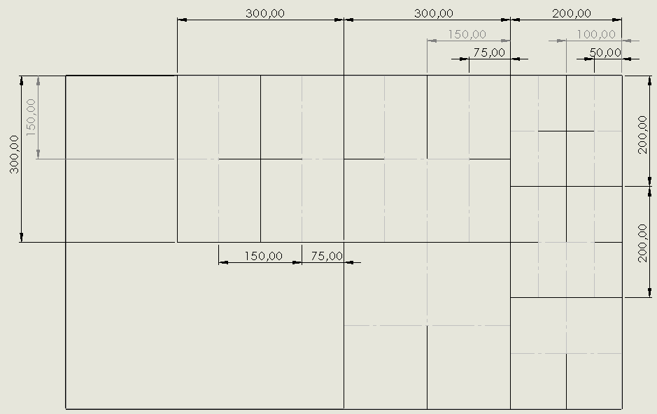

# kotni-reflektor
Kotni reflektor za radar; Corner reflektor for radar

Debelina aluminjaste plošče - 0,8 mm
Predvidena debelina reza - 0,9 mm (da se lahko posamezni kosi lažje zložijo skupaj)

## Nacrt razreza

  
  

## Skica sestavljene strukture z izracuni za odmevno povrsino

